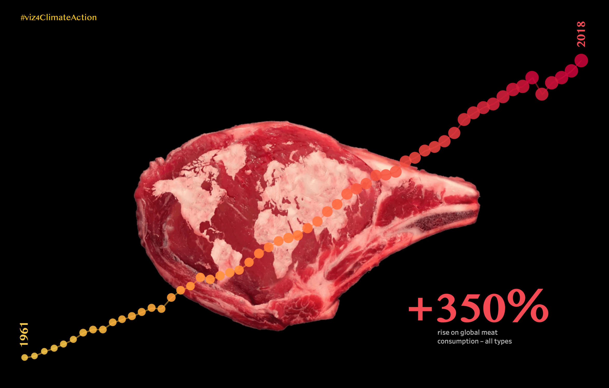

##### *Data Analytics Bootcamp* – Project 2

<br>


<br>

<br>

> ⏰ <i>Time's short?</i>
>
> 👉 [Click here to check my presentation](https://public.tableau.com/app/profile/altermann/viz/Ironhack_Bootcamp_Project_2_meat_the_future/meat_the_future), hosted by Tableau ♡

<br>

## Project Documentation
- [Project Description](#project-description)
- [Goals](#goals)
- [Deliverable files in this repository](#deliverables)
- [Tech](#tech)
- [Dataset](#dataset)

<a name="project-description"></a>

## Project Description

Let's refresh some important history facts about climate change.

```

▫️ In 1896, a seminal paper by Swedish scientist Svante Arrhenius first predicted that changes
in atmospheric carbon dioxide levels could substantially alter the surface temperature through
the greenhouse effect.

▫️ In 1938, Guy Callendar connected carbon dioxide increases in Earth’s atmosphere to global
warming.

▫️ In 1956, Gilbert Plass formulated the Carbon Dioxide Theory of Climate Change.

▫️ The planet's average surface temperature has risen about 1.18 degrees Celsius since the
late 19th century, a change driven largely by increased carbon dioxide emissions into the
atmosphere and other human activities.

▫️ Most of the warming occurred in the past 40 years, with the seven most recent years being
the warmest.

▫️ The years 2016 and 2020 are tied for the warmest year on record. 

```
###### Source: [NASA](https://climate.nasa.gov/evidence/)

<br>



###### Beef image source: Shutterstock.

<br>

<a name="goals"></a>

## Goals

```

▫️ Research, collect and analyse data (API / web scraping)

▫️ Apply the programming and statistical techniques

▫️ Create useful and easily-interpretable plots

▫️ Communicate the analysis results clearly, accurately, and engagingly

```

<br>

<a name="deliverables"></a>

## Deliverable files in this repository

* Cleaned final dataset (./assets):
   - `fesc.csv`
   - `meat_veg.csv`
   - `meat_veg_tonnes.csv`
   - `wb_population.csv`

* Data analysis in Jupyter Notebook:
   - `project_02_ironhack_meat_the_future_api.ipynb`
   - `project_02_ironhack_meat_the_future_data.ipynb`
 
* Formal presentation – Storytelling with data:
   - done with `Tableau` [check it here](https://public.tableau.com/app/profile/altermann/viz/Ironhack_Bootcamp_Project_2_meat_the_future/meat_the_future)

<br>

<a name="tech"></a>

## Tech

   - Python @ Jupyter Notebook
   - Pandas / Numpy
   - API / web scraping
   - Tableau

<br>

<a name="dataset"></a>

## Dataset

▫️ [Food and Agriculture Organization of the United Nations](http://www.fao.org)

▫️ [The World Bank API](https://datahelpdesk.worldbank.org/)

▫️ [WBGAPI](https://pypi.org/project/wbgapi/) – pythonic access to the World Bank's data API

▫️ [Our World in Data](https://ourworldindata.org/)

<br>

<br>


###### Painting image [source](https://commons.wikimedia.org/wiki/File:Arcimboldo_Oto%C3%B1o.jpg)

