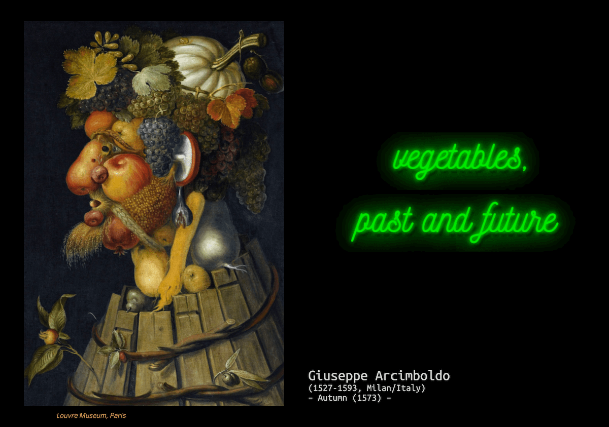

##### *Data Analytics Bootcamp* – Project 2

<br>


<br>

<br>

> ⏰ <i>Time's short?</i>
>
> 👉 [Click here to check my presentation](missing_link), hosted by Tableau ♡

<br>

## Project Documentation
- [Project Description](#project-description)
- [Hypotheses / Questions](#hypotheses-/-questions)
- [Dataset](#dataset)
- [Workflow](#workflow)
- [Organization](#organization)
- [Tech](#tech)

<a name="project-description"></a>

## Project Description

```

▫️ In 1896, a seminal paper by Swedish scientist Svante Arrhenius first predicted that changes in atmospheric
carbon dioxide levels could substantially alter the surface temperature through the greenhouse effect.

▫️ In 1938, Guy Callendar connected carbon dioxide increases in Earth’s atmosphere to global warming.

▫️ In 1956, Gilbert Plass formulated the Carbon Dioxide Theory of Climate Change.

```
Source: [NASA](https://climate.nasa.gov/evidence/)


<a name="hypotheses-/-questions"></a>

## Hypotheses / Questions

```

▫️ tba

```

<a name="dataset"></a>

## Dataset

▫️ [Food and Agriculture Organization of the United Nations](http://www.fao.org)

▫️ [The World Bank API](https://datahelpdesk.worldbank.org/)

▫️ [WBGAPI](https://pypi.org/project/wbgapi/) – pythonic access to the World Bank's data API

▫️ [Our World in Data](https://ourworldindata.org/)


<a name="workflow"></a>

## Workflow


<a name="organization"></a>

## Organization


<a name="tech"></a>

## Tech

   - Python @ Jupyter Notebook
   - Pandas / Numpy
   - API / web scraping
   - Tableau

<br>



###### <i>image [source](https://commons.wikimedia.org/wiki/File:Arcimboldo_Oto%C3%B1o.jpg)</i>

